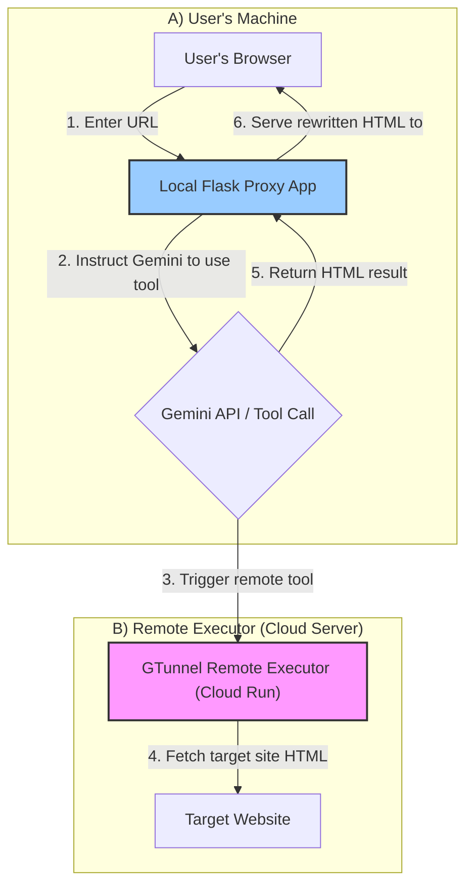

# GTunnel - An Information Tunnel Born from the Cracks in a Digital Walled Garden

[中文版](README.md)

[](https://www.gnu.org/licenses/gpl-3.0)
[](CONTRIBUTING.en.md)

**This is a story about finding information freedom in the face of harsh restrictions. GTunnel is an experimental web proxy project that uses a Large Language Model (Google Gemini) as an "information tunnel" to fetch the outside world's web pages for you from within a restricted network environment.**


---

## The Story Begins: A Digital Island

Imagine being inside a "**Walled Garden**" meticulously constructed by a network administrator. In this environment, most internet services are blocked, and even VPNs fail to connect.

However, we discovered a crack in this wall: certain Google services, especially communication with the **Gemini API**, were allowed through. This discovery led to a bold idea: If we can't climb over the wall, can we ask a privileged service "inside the wall" to pass information to us from the "outside"?

And so, GTunnel was born. It doesn't try to bypass the firewall; it cleverly plays by its rules.

## Core Concept: Command Gemini to Fetch for You

GTunnel operates completely differently from a traditional proxy:

1.  The **`local_proxy`** runs on your machine and does not access the external network directly.
2.  When you request a URL, the local proxy sends a prompt to the Gemini API, instructing it to use a custom "tool" named `fetch_html`.
3.  The actual implementation of this "tool" is the **`remote_executor`**, which we deploy to a cloud environment (Google Cloud Run).
4.  The Gemini API triggers the remote executor, which is responsible for fetching the HTML content of the target website.
5.  The remote executor passes the fetched HTML content back to the local proxy through the Gemini API's tool response mechanism.
6.  Upon receiving the HTML, the local proxy rewrites all links on the page to point back to the proxy service itself, finally rendering the page to you.

### MVP Architecture Diagram



## MVP Features

- ✅ End-to-end web proxying flow based on Gemini Function Calling.
- ✅ Dynamic rewriting of `href` and `src` attributes in HTML to support continuous browsing within the proxy environment.
- ✅ Dual-component architecture: a locally running proxy server and a serverless executor deployed in the cloud.

## Tech Stack

- **Local Proxy**: Python, Flask, Google Generative AI SDK
- **Remote Executor**: Python, Flask, Requests
- **HTML Parsing**: BeautifulSoup4
- **Deployment**: Docker, Google Cloud Run
- **Python Environment**: `uv`

## Setup and Usage

Please follow the detailed steps in this document, ensuring you have met all the [Prerequisites](#prerequisites).

### Prerequisites

- Python 3.10+
- `uv` (or `pip`)
- `gcloud` CLI tool, authenticated with your Google account
- A Google Cloud project with billing enabled

### 1. Deploy the Remote Executor

First, you need to deploy the `remote_executor` to Google Cloud Run.

```bash
# Navigate to the remote_executor directory
cd gtunnel_project/remote_executor

# Follow the prompts to set your Project ID, Region, and Service Name
# (For detailed commands, refer to the debugging log in GEMINI.md)
gcloud config set project YOUR_PROJECT_ID
gcloud services enable run.googleapis.com artifactregistry.googleapis.com cloudbuild.googleapis.com
gcloud artifacts repositories create REPO_NAME --repository-format=docker --location=REGION
gcloud builds submit --region=REGION --tag REGION-docker.pkg.dev/YOUR_PROJECT_ID/REPO_NAME/SERVICE_NAME:latest .
gcloud run deploy SERVICE_NAME --image=...

# After a successful deployment, you must set the service to be publicly accessible
gcloud run services add-iam-policy-binding SERVICE_NAME --member="allUsers" --role="roles/run.invoker" --region=REGION
```

Upon successful deployment, you will receive a Service URL, e.g., `https://your-service-name-xxxx-xx.a.run.app`.

### 2. Configure and Run the Local Proxy

1.  **Set Environment Variables**: 
    Navigate to the `gtunnel_project/local_proxy` directory, create a `.env` file, and add the following content:

    ```
    # Your Google Gemini API Key
    GEMINI_API_KEY=AIzaSy...

    # The URL of your deployed remote executor (must include the /execute_tool path)
    REMOTE_EXECUTOR_URL=https://your-service-name-xxxx-xx.a.run.app/execute_tool
    ```

2.  **Install Dependencies**: 
    In the `local_proxy` directory, run:
    ```bash
    uv sync
    ```

3.  **Start the Server**: 
    ```bash
    uv run python main.py
    ```

4.  **Start Browsing**: 
    Open your web browser and go to `http://127.0.0.1:5000`.

## Contributing

We warmly welcome contributions of any kind! Whether it's reporting bugs, suggesting new features, or submitting code directly. Please refer to our [**Contribution Guidelines (CONTRIBUTING.en.md)**](CONTRIBUTING.en.md) to get started.

## License

This project is licensed under the **GNU General Public License v3.0 (GPLv3)**.

This means you are free to use, modify, and distribute this project, but any derivative works **must** also be open-sourced under the same GPLv3 terms. For more details, please see the [LICENSE](LICENSE) file.

## Future Work

The current MVP version only supports proxying plain HTML content. Future versions plan to integrate Firebase as an intermediary storage layer to support more complex rich media content, such as CSS, JavaScript, and images.
