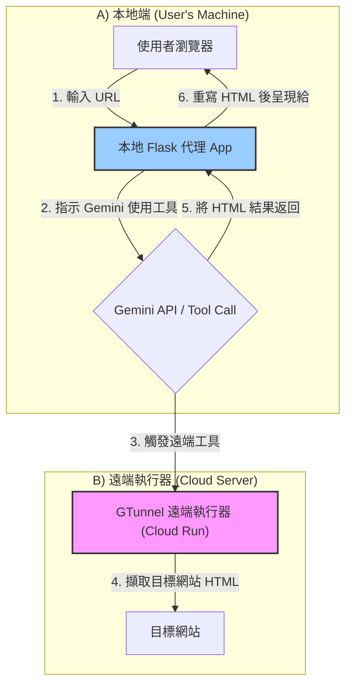

# GTunnel - 誕生於數位高牆裂縫中的資訊隧道

[English Version](README.en.md)

[](https://www.gnu.org/licenses/gpl-3.0)
[](CONTRIBUTING.md)

**這是一個關於在嚴苛限制中尋找資訊自由的故事。GTunnel 是一個實驗性的網頁代理專案，它利用大型語言模型 (Google Gemini) 作為「資訊隧道」，為您從受限的網路環境中擷取外部世界的網頁。**


---

## 故事的開始：數位孤島

想像一下，您身處一個由網路管理員精心構築的「**數位高牆 (Walled Garden)**」之內。在這個環境中，絕大多數網路服務都被阻擋，甚至連 VPN 都無法連線。

然而，我們發現了這座高牆上的一絲裂縫：某些 Google 服務，特別是與 **Gemini API** 的通訊，竟然可以暢行無阻。這個發現引出了一個大膽的想法：如果我們無法「翻牆」，那麼是否可以讓「牆內」的特權服務，為我們從「牆外」把資訊遞進來？

GTunnel 就此誕生。它不試圖繞過防火牆，而是聰明地利用了規則。

## 核心概念：命令 Gemini 為你「取物」

GTunnel 的運作方式與傳統代理完全不同：

1.  **本地代理 (`local_proxy`)** 在您的本機運行，它本身不存取外部網路。
2.  當您請求一個 URL 時，本地代理會向 Gemini API 發送一個指令，要求它使用一個名為 `fetch_html` 的自訂「工具」。
3.  這個「工具」的真正實作是我們部署在雲端 (Google Cloud Run) 的 **遠端執行器 (`remote_executor`)**。
4.  Gemini API 觸發遠端執行器，後者負責擷取目標網頁的 HTML 內容。
5.  遠端執行器將 HTML 內容透過 Gemini API 的工具回應機制，回傳給本地代理。
6.  本地代理收到 HTML 後，重寫頁面中的所有連結，使其指向代理服務本身，最終呈現給您。

### MVP 架構圖



## MVP 功能

- ✅ 基於 Gemini Function Calling 的端對端網頁代理流程。
- ✅ 動態重寫 HTML 中的 `href` 和 `src` 屬性，以支援在代理環境下的連續瀏覽。
- ✅ 雙組件架構：在本機運行的代理伺服器和部署在雲端的無伺服器 (Serverless) 執行器。

## 技術棧

- **本地代理**: Python, Flask, Google Generative AI SDK
- **遠端執行器**: Python, Flask, Requests
- **HTML 解析**: BeautifulSoup4
- **部署**: Docker, Google Cloud Run
- **Python 環境**: `uv`

## 安裝與使用

詳細步驟請參考本文件，確保您已安裝所有 [前置需求](#前置需求)。

### 前置需求

- Python 3.10+
- `uv` (或 `pip`)
- `gcloud` CLI 工具，並已登入您的 Google 帳號
- 一個已啟用帳單功能的 Google Cloud 專案

### 1. 部署遠端執行器

首先，需要將 `remote_executor` 部署到 Google Cloud Run。

```bash
# 進入遠端執行器目錄
cd gtunnel_project/remote_executor

# 根據提示設定您的專案 ID、區域和服務名稱
# (詳細指令請參考 GEMINI.md 中的除錯日誌)
gcloud config set project YOUR_PROJECT_ID
gcloud services enable run.googleapis.com artifactregistry.googleapis.com cloudbuild.googleapis.com
gcloud artifacts repositories create REPO_NAME --repository-format=docker --location=REGION
gcloud builds submit --region=REGION --tag REGION-docker.pkg.dev/YOUR_PROJECT_ID/REPO_NAME/SERVICE_NAME:latest .
gcloud run deploy SERVICE_NAME --image=...

# 部署成功後，請務必將服務設為公開存取
gcloud run services add-iam-policy-binding SERVICE_NAME --member="allUsers" --role="roles/run.invoker" --region=REGION
```

部署成功後，您會獲得一個服務 URL，例如 `https://your-service-name-xxxx-xx.a.run.app`。

### 2. 設定並啟動本地代理

1.  **設定環境變數**: 
    進入 `gtunnel_project/local_proxy` 目錄，建立一個 `.env` 檔案，並填入以下內容：

    ```
    # 您的 Google Gemini API 金鑰
    GEMINI_API_KEY=AIzaSy...

    # 您上一步部署的遠端執行器 URL (需包含 /execute_tool 路徑)
    REMOTE_EXECUTOR_URL=https://your-service-name-xxxx-xx.a.run.app/execute_tool
    ```

2.  **安裝依賴**: 
    在 `local_proxy` 目錄下，執行：
    ```bash
    uv sync
    ```

3.  **啟動服務**: 
    ```bash
    uv run python main.py
    ```

4.  **開始使用**: 
    打開瀏覽器，訪問 `http://127.0.0.1:5000`。

## 如何貢獻

我們非常歡迎任何形式的貢獻！無論是回報問題、提出功能建議，還是直接提交程式碼。請參考我們的 [**貢獻指南 (CONTRIBUTING.md)**](CONTRIBUTING.md) 來開始您的第一步。

## 授權條款

本專案採用 **GNU General Public License v3.0 (GPLv3)** 授權。

這意味著您可以自由地使用、修改和分發本專案，但任何基於本專案的衍生作品也**必須**以相同的 GPLv3 條款開源。詳細資訊請參閱 [LICENSE](LICENSE) 檔案。

## 未來展望

目前的 MVP 版本僅支援純 HTML 內容的代理。後續版本計畫引入 Firebase 作為中介儲存層，以支援更複雜的富媒體內容，如 CSS, JavaScript 和圖片。
